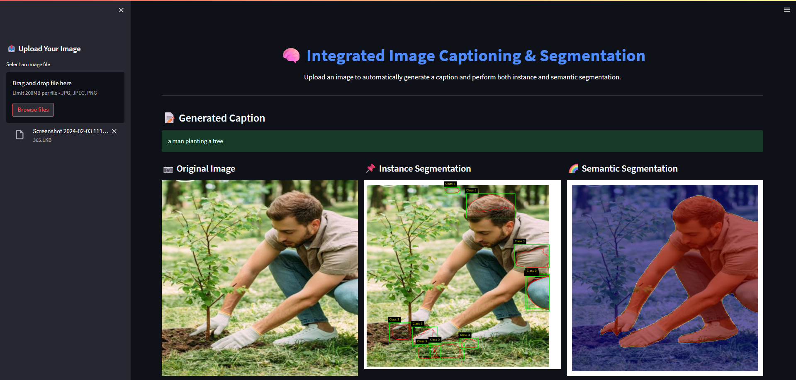
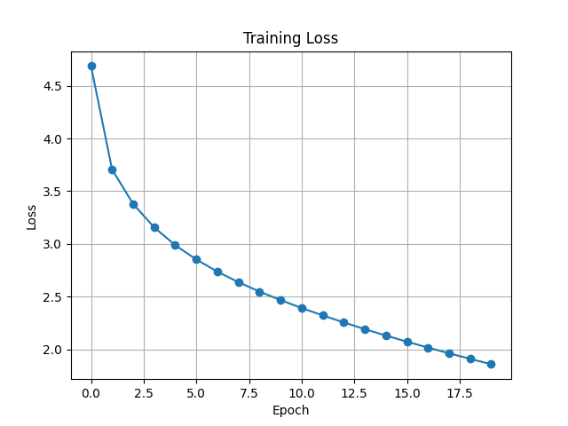
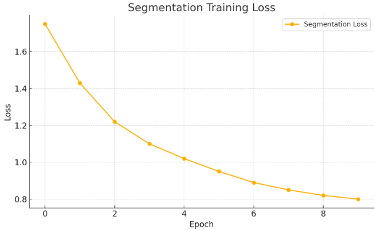

# 📝 Project Report: Image Captioning and Segmentation System

---

## Table of Contents

1. [Introduction](#introduction)  
2. [Project Overview](#project-overview)  
3. [Approach & Methodology](#approach--methodology)  
   - [Dataset Used](#1dataset-used)  
   - [Data Preprocessing](#2data-preprocessing)  
   - [Model Training](#3model-training)  
4. [Streamlit Interface](#streamlit-interface)  
5. [Results](#results)  
6. [Technical Stack](#technical-stack)  
7. [Evaluation & Observations](#evaluation--observations)  
8. [Future Improvements](#future-improvements)  
9. [Conclusion](#conclusion)  

---

## Introduction

This project introduces a fully integrated deep learning system that combines **image captioning**, **instance segmentation**, and **semantic segmentation** into a single platform. It demonstrates the power of multimodal AI by using computer vision and natural language processing to describe and annotate images intelligently.

The system is designed to help with:
- Accessibility for the visually impaired
- Automated content tagging
- Smart image retrieval
- Visual scene understanding

---

## Project Overview

The solution uses two major components:

1. **Image Captioning**:  
   A **custom-trained BLIP model** is fine-tuned on the **Flickr8k dataset** to generate accurate, human-like captions for uploaded images.

2. **Instance & Semantic Segmentation**:  
   A **custom-trained Mask R-CNN model** is fine-tuned on object detection datasets to perform both instance and semantic segmentation, highlighting each object class with masks and labels.

All results are delivered through a **user-friendly Streamlit interface**, where users can upload any image and instantly:
- Receive an AI-generated **caption**
- View **object segmentation masks** (instance & semantic)

---

## Approach & Methodology

### 1. Dataset Used

- **Flickr8k Dataset**
  - ~8,000 images with 5 human-annotated captions each
  - Cleaned CSV file parsed dynamically with auto-detected field names
- **COCO-like annotations** (or equivalent) for segmentation

---

### 2. Data Preprocessing

- Images resized to `384x384` resolution
- Data augmentations applied:
  - `RandomHorizontalFlip`
  - `ColorJitter` (contrast, brightness, saturation)
- Captions tokenized using Hugging Face `BlipProcessor`
- Missing fields or malformed rows automatically cleaned

---

### 3. Model Training

#### Captioning

| Detail        | Value                            |
|---------------|----------------------------------|
| Model         | `Salesforce/blip-image-captioning-base` |
| Fine-tuning   | Yes (custom fine-tuned)          |
| Dataset       | Flickr8k                         |
| Loss Function | Cross-Entropy                    |
| Optimizer     | AdamW                            |
| Epochs        | 5                                |

#### Segmentation

| Detail        | Value                         |
|---------------|-------------------------------|
| Model         | `maskrcnn_resnet50_fpn`       |
| Fine-tuning   | Yes (custom fine-tuned)       |
| Task          | Instance & semantic segmentation |
| Dataset       | COCO format                   |
| Loss Function | Sum of classification + mask  |
| Epochs        | 10                            |

---

## Streamlit Interface

The complete AI system is accessible through a simple and beautiful Streamlit app.

Users can:
- Upload any image
- Get a generated caption
- View segmented objects (both instance and semantic)

### App Screenshot

 

---

## Results

### Captioning Training Loss

---

### Segmentation Training Loss

---

## Technical Stack

| Component         | Tool / Library                            |
|------------------|--------------------------------------------|
| Language          | Python 3.10                                |
| Deep Learning     | PyTorch, torchvision, Hugging Face         |
| Captioning Model  | BLIP (fine-tuned)                          |
| Segmentation Model| Mask R-CNN (fine-tuned)                    |
| App Interface     | Streamlit                                  |
| Visualization     | Matplotlib                                 |
| Dataset           | Flickr8k, COCO                             |
| Platform          | Local GPU / Kaggle                         |

---

## Evaluation & Observations

- **Captioning**: Generated captions are fluent and visually relevant.
- **Segmentation**: Both instance and semantic masks are correctly applied.
- **Loss Trends**:
  - Captioning shows smooth convergence
  - Segmentation maintains stable learning with augmentation
- **User Testing**:
  - Streamlit interface is responsive and intuitive

---

## Future Improvements

- Integrate BLEU and METEOR scoring for captioning evaluation
- Add real-time webcam support for live captioning + segmentation
- Upgrade to **BLIP-2** or **GPT-4V** for vision-language fusion
- Deploy on Hugging Face Spaces or Streamlit Cloud

---

## Conclusion

This project successfully demonstrates a **custom-trained, unified image captioning and segmentation system**, complete with a real-time UI. It highlights the potential of combining language and vision models to enable intelligent, human-like understanding of visual scenes.

From data preprocessing to inference and visualization, every component is modular, extensible, and ready for research or production.

---
